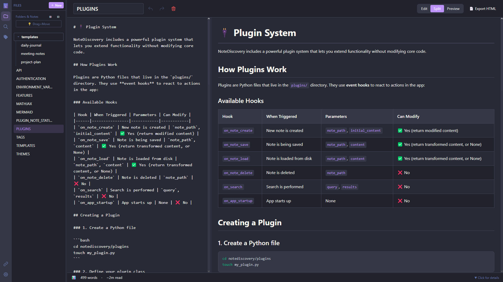

# 📝 NoteDiscovery


> Your Self-Hosted Knowledge Base

🌐 **[Visit the official website](https://www.notediscovery.com)**

🚀 **[Try the Live Demo](https://gamosoft-notediscovery-demo.hf.space)** — *Contents reset daily, for demonstration purposes only*

## What is NoteDiscovery?

NoteDiscovery is a **lightweight, self-hosted note-taking application** that puts you in complete control of your knowledge base. Write, organize, and discover your notes with a beautiful, modern interface—all running on your own server.



## 🎯 Who is it for?

- **Privacy-conscious users** who want complete control over their data
- **Developers** who prefer markdown and local file storage
- **Knowledge workers** building a personal wiki or second brain
- **Teams** looking for a self-hosted alternative to commercial apps
- **Anyone** who values simplicity, speed, and ownership


## 💖 Thanks for using NoteDiscovery!
If this project has been useful to you, consider supporting its development, it truly makes a difference!

<p align="center">
  <a href="https://ko-fi.com/gamosoft" target="_blank" rel="noopener noreferrer"></a>
</p>

## ✨ Why NoteDiscovery?

### vs. Commercial Apps (Notion, Evernote, Obsidian Sync)

| Feature | NoteDiscovery | Commercial Apps |
|---------|---------------|-----------------|
| **Cost** | 100% Free | $xxx/month/year |
| **Privacy** | Your server, your data | Their servers, their terms |
| **Speed** | Lightning fast | Depends on internet |
| **Offline** | Always works | Limited or requires sync |
| **Customization** | Full control | Limited options |
| **No Lock-in** | Plain markdown files | Proprietary formats |

### Key Benefits

- 🔒 **Total Privacy** - Your notes never leave your server
- 🔐 **Optional Authentication** - Simple password protection for self-hosted deployments
- 💰 **Zero Cost** - No subscriptions, no hidden fees
- 🚀 **Fast & Lightweight** - Instant search and navigation
- 🎨 **Beautiful Themes** - Multiple themes, easy to customize
- 🔌 **Extensible** - Plugin system for custom features
- 📱 **Responsive** - Works on desktop, tablet, and mobile
- 📂 **Simple Storage** - Plain markdown files in folders
- 🧮 **Math Support** - LaTeX/MathJax for beautiful equations
- 📄 **HTML Export** - Share notes as standalone HTML files
- 🕸️ **Graph View** - Interactive visualization of connected notes
- ⭐ **Favorites** - Star your most-used notes for instant access
- 📑 **Outline Panel** - Navigate headings with click-to-jump TOC

## 🚀 Quick Start

### Running from GitHub Container Registry (Easiest & Recommended)

Use the pre-built image directly from GHCR - no building required!

> **💡 Tip**: Always use `ghcr.io/gamosoft/notediscovery:latest` to get the newest features and fixes.

> **📁 Important - Volume Mapping**: The container needs local folders/files to work:
> - **Required**: `data` folder - **Your personal notes** will be stored here (create an empty folder)
> - **Required**: `themes` folder with theme `.css` files (at least a single theme must exist)
> - **Required**: `plugins` folder (can be empty for basic functionality)
> - **Required**: `config.yaml` file (needed for the app to run)
> - **Optional**: `documentation` folder - If you cloned the repo, mount this to view app docs inside NoteDiscovery
> 
> **Setup Options:**
> 
> 1. **Minimal** (quick test - download just the essentials):
>    ```bash
>    # Linux/macOS
>    mkdir -p data plugins themes  # data/ is for YOUR notes
>    curl -O https://raw.githubusercontent.com/gamosoft/notediscovery/main/config.yaml
>    # Download at least light and dark themes
>    curl -o themes/light.css https://raw.githubusercontent.com/gamosoft/notediscovery/main/themes/light.css
>    curl -o themes/dark.css https://raw.githubusercontent.com/gamosoft/notediscovery/main/themes/dark.css
>    ```
>    
>    ```powershell
>    # Windows PowerShell
>    mkdir data, plugins, themes -Force  # data\ is for YOUR notes
>    Invoke-WebRequest -Uri https://raw.githubusercontent.com/gamosoft/notediscovery/main/config.yaml -OutFile config.yaml
>    # Download at least light and dark themes
>    Invoke-WebRequest -Uri https://raw.githubusercontent.com/gamosoft/notediscovery/main/themes/light.css -OutFile themes/light.css
>    Invoke-WebRequest -Uri https://raw.githubusercontent.com/gamosoft/notediscovery/main/themes/dark.css -OutFile themes/dark.css
>    ```
> 
> 2. **Full Setup** (recommended - includes all themes, plugins, and documentation):
>    ```bash
>    git clone https://github.com/gamosoft/notediscovery.git
>    cd notediscovery
>    # The data/ folder is empty - for your personal notes
>    # The documentation/ folder has app docs you can optionally mount
>    ```

> **🔐 Security Note**: Authentication is **disabled by default** with password `admin`. 
> - ✅ **Local/Testing**: Default credentials are fine
> - ⚠️ **Public Network**: Change password immediately - see [AUTHENTICATION.md](documentation/AUTHENTICATION.md)
> - 🎭 **Demo Deployment**: Uses default "admin" password

**Option 1: Docker Compose (Recommended)**

> 💡 **Multi-Architecture Support**: Docker images are available for both `x86_64` and `ARM64` (Raspberry Pi, Apple Silicon, etc.)

```bash
# Linux/macOS - Create required directories and files, then start
mkdir -p data plugins themes
curl -O https://raw.githubusercontent.com/gamosoft/notediscovery/main/config.yaml
curl -o themes/light.css https://raw.githubusercontent.com/gamosoft/notediscovery/main/themes/light.css
curl -o themes/dark.css https://raw.githubusercontent.com/gamosoft/notediscovery/main/themes/dark.css
curl -O https://raw.githubusercontent.com/gamosoft/notediscovery/main/docker-compose.ghcr.yml
docker-compose -f docker-compose.ghcr.yml up -d

# Access at http://localhost:8000
# Login with default password: admin

# View logs
docker-compose -f docker-compose.ghcr.yml logs -f

# Stop the application
docker-compose -f docker-compose.ghcr.yml down
```

```powershell
# Windows PowerShell
mkdir data, plugins, themes -Force
Invoke-WebRequest -Uri https://raw.githubusercontent.com/gamosoft/notediscovery/main/config.yaml -OutFile config.yaml
Invoke-WebRequest -Uri https://raw.githubusercontent.com/gamosoft/notediscovery/main/themes/light.css -OutFile themes/light.css
Invoke-WebRequest -Uri https://raw.githubusercontent.com/gamosoft/notediscovery/main/themes/dark.css -OutFile themes/dark.css
Invoke-WebRequest -Uri https://raw.githubusercontent.com/gamosoft/notediscovery/main/docker-compose.ghcr.yml -OutFile docker-compose.ghcr.yml
docker-compose -f docker-compose.ghcr.yml up -d
```

**Option 2: Docker Run (Alternative)**

```bash
# Linux/macOS
mkdir -p data plugins themes
curl -O https://raw.githubusercontent.com/gamosoft/notediscovery/main/config.yaml
curl -o themes/light.css https://raw.githubusercontent.com/gamosoft/notediscovery/main/themes/light.css
curl -o themes/dark.css https://raw.githubusercontent.com/gamosoft/notediscovery/main/themes/dark.css
docker run -d \
  --name notediscovery \
  -p 8000:8000 \
  -v $(pwd)/data:/app/data \
  -v $(pwd)/plugins:/app/plugins \
  -v $(pwd)/themes:/app/themes \
  -v $(pwd)/locales:/app/locales \
  -v $(pwd)/config.yaml:/app/config.yaml \
  --restart unless-stopped \
  ghcr.io/gamosoft/notediscovery:latest
```

```powershell
# Windows PowerShell
mkdir data, plugins, themes -Force
Invoke-WebRequest -Uri https://raw.githubusercontent.com/gamosoft/notediscovery/main/config.yaml -OutFile config.yaml
Invoke-WebRequest -Uri https://raw.githubusercontent.com/gamosoft/notediscovery/main/themes/light.css -OutFile themes/light.css
Invoke-WebRequest -Uri https://raw.githubusercontent.com/gamosoft/notediscovery/main/themes/dark.css -OutFile themes/dark.css
docker run -d `
  --name notediscovery `
  -p 8000:8000 `
  -v ${PWD}/data:/app/data `
  -v ${PWD}/plugins:/app/plugins `
  -v ${PWD}/themes:/app/themes `
  -v ${PWD}/locales:/app/locales `
  -v ${PWD}/config.yaml:/app/config.yaml `
  --restart unless-stopped `
  ghcr.io/gamosoft/notediscovery:latest
```

Access at http://localhost:8000

**Why use the GHCR image?**
- ✅ No build time - instant deployment
- ✅ Always up-to-date with the latest release
- ✅ Tested and verified builds
- ✅ Smaller download with optimized layers

### Running with Docker Compose (Recommended for Development)

Docker ensures consistent environment and easy deployment:

```bash
# Clone the repository
git clone https://github.com/gamosoft/notediscovery.git
cd notediscovery

# Start with Docker Compose
docker-compose up -d

# Access at http://localhost:8000

# View logs
docker-compose logs -f

# Stop the application
docker-compose down
```

**Requirements:**
- Docker
- Docker Compose

### Running Locally (Without Docker)

For development or if you prefer running directly:

```bash
# Clone the repository
git clone https://github.com/gamosoft/notediscovery.git
cd notediscovery

# Install dependencies
pip install -r requirements.txt

# Run the application
python run.py

# Access at http://localhost:8000
```

**Requirements:**
- Python 3.8 or higher
- pip (Python package manager)

**Dependencies installed:**
- FastAPI - Web framework
- Uvicorn - ASGI server
- PyYAML - Configuration handling
- aiofiles - Async file operations

## 📚 Documentation

Want to learn more?

- 🎨 **[THEMES.md](documentation/THEMES.md)** - Theme customization and creating custom themes
- ✨ **[FEATURES.md](documentation/FEATURES.md)** - Complete feature list and keyboard shortcuts
- 🏷️ **[TAGS.md](documentation/TAGS.md)** - Organize notes with tags and combined filtering
- 📋 **[TEMPLATES.md](documentation/TEMPLATES.md)** - Create notes from reusable templates with dynamic placeholders
- 🧮 **[MATHJAX.md](documentation/MATHJAX.md)** - LaTeX/Math notation examples and syntax reference
- 📊 **[MERMAID.md](documentation/MERMAID.md)** - Diagram creation with Mermaid (flowcharts, sequence diagrams, and more)
- 🔌 **[PLUGINS.md](documentation/PLUGINS.md)** - Plugin system and available plugins
- 🌐 **[API.md](documentation/API.md)** - REST API documentation and examples
- 🔐 **[AUTHENTICATION.md](documentation/AUTHENTICATION.md)** - Enable password protection for your instance
- 🔧 **[ENVIRONMENT_VARIABLES.md](documentation/ENVIRONMENT_VARIABLES.md)** - Configure settings via environment variables

## 🌍 Multiple Languages

NoteDiscovery supports multiple languages! Currently available:
- 🇺🇸 English (en-US) - Default
- 🇪🇸 Español (es-ES)
- 🇩🇪 Deutsch (de-DE)
- 🇫🇷 Français (fr-FR)

**To change language:** Go to Settings (gear icon) → Language dropdown.

**To add your own language:** See the [Contributing Guidelines](CONTRIBUTING.md#-contributing-translations) for instructions on creating translation files.

**Docker users:** Mount your custom locales folder to add or override translations:

```yaml
volumes:
  - ./locales:/app/locales  # Custom translations
```

💡 **Pro Tip:** If you clone this repository, you can mount the `documentation/` folder to view these docs inside the app:

```yaml
# In your docker-compose.yml
volumes:
  - ./data:/app/data              # Your personal notes
  - ./documentation:/app/data/docs:ro  # Mount docs subfolder inside the data folder (read-only)
```

Then access them at `http://localhost:8000` - the docs will appear as a `docs/` folder in the file browser!

## 🤝 Contributing

**Before submitting a pull request**, especially for major changes, please:
- Read our **[Contributing Guidelines](CONTRIBUTING.md)**
- Open an issue first to discuss major features or significant changes
- Ensure your code follows the project's style and philosophy


## 🔒 Security Considerations

NoteDiscovery is designed for **self-hosted, private use**. Please keep these security considerations in mind:

### Network Security
- ⚠️ **Do NOT expose directly to the internet** without additional security measures
- Run behind a reverse proxy (nginx, Caddy) with HTTPS for production use
- Keep it on your local network or use a VPN for remote access
- By default, the app listens on `0.0.0.0:8000` (all network interfaces)

### Authentication
- **Password protection is ENABLED by default** with password: `admin`
- ⚠️ **CHANGE THE DEFAULT PASSWORD IMMEDIATELY** if exposing to a network!
- See **[AUTHENTICATION.md](documentation/AUTHENTICATION.md)** for complete setup instructions
- To disable auth, set `authentication.enabled: false` in `config.yaml`
- Change password with Docker: `docker-compose exec notediscovery python generate_password.py`
- Perfect for single-user or small team deployments
- For multi-user setups, consider a reverse proxy with OAuth/SSO

### Data Privacy
- Your notes are stored as **plain text markdown files** in the `data/` folder
- No data is sent to external services
- Regular backups are recommended

### Best Practices
- Run on `localhost` or a private network only
- Use Docker for isolation and easier security management
- Keep your system and dependencies updated
- Review and audit any plugins you install
- Set appropriate file permissions on the `data/` directory

**TL;DR**: Perfect for personal use on your local machine or home network. Enable built-in password protection if needed, or use a reverse proxy with authentication if exposing to wider networks.

## 📄 License

MIT License - Free to use, modify, and distribute.

---

Made with ❤️ for the self-hosting community
